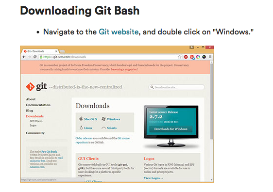
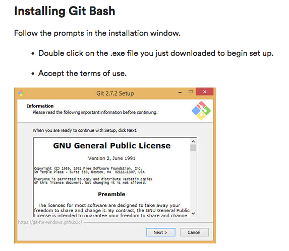
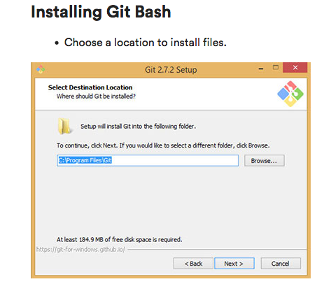
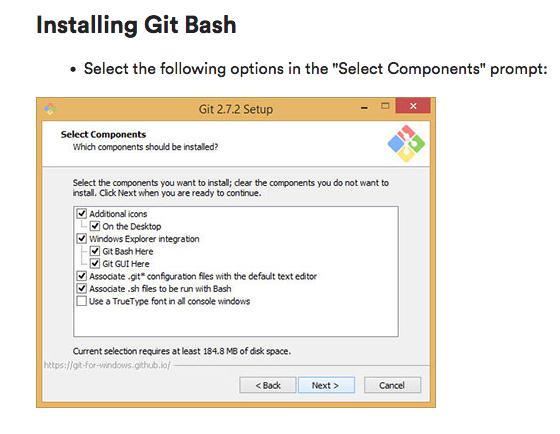
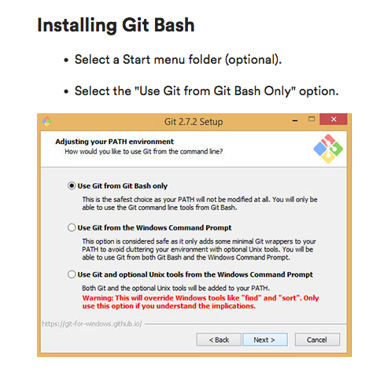
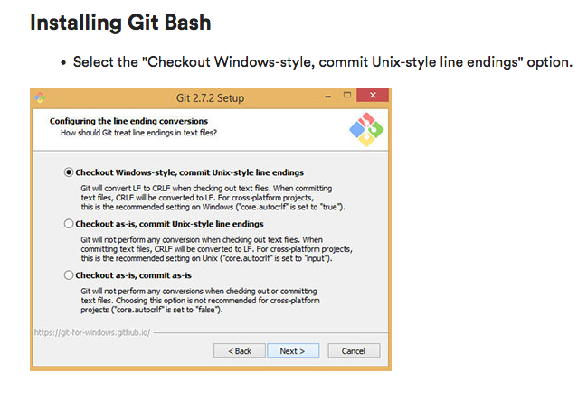
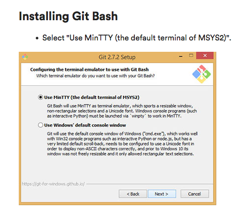
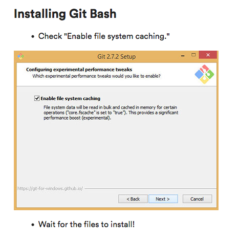

<!-- TOC -->

- [Homebrew](#homebrew)
    - [Brew Cask](#brew-cask)
- [Visual Studio Code](#visual-studio-code)
    - [VS Code Extensions](#vs-code-extensions)
- [Git](#git)
    - [Git Bash](#git-bash)
- [Node](#node)
- [Spectacle](#spectacle)
- [Flycut](#flycut)
- [iTerm](#iterm)
- [Optional: Command-Line Helpers with Bash-It](#optional-command-line-helpers-with-bash-it)

<!-- /TOC -->

# Homebrew
Install homebrew by running this command in the terminal, after it has installed restart your terminal

`/usr/bin/ruby -e "$(curl -fsSL https://raw.githubusercontent.com/Homebrew/install/master/install)"`

## Brew Cask
Brew cask allows you to install apps, restart your terminal after installing. 

`brew tap caskroom/cask`
# Visual Studio Code
[Click Here for visual studio code](https://code.visualstudio.com/)
OR
`brew cask install visual-studio-code`

**if you install with brew cask you will be able to open vs code through your terminal by typing `code .` otherwise if you install through the link in visual studio code hit `command+Shift+P` or click settings and then click command palette and  type `code` and click `Shell command: Install code command in path`*

## VS Code Extensions

Jamie's Visual Studio code extensions. Run in your terminal.
```
code --install-extension 2gua.rainbow-brackets
code --install-extension Zignd.html-css-class-completion
code --install-extension christian-kohler.path-intellisense
code --install-extension dbaeumer.vscode-eslint
code --install-extension donjayamanne.githistory
code --install-extension ecmel.vscode-html-css
code --install-extension eg2.vscode-npm-script
code --install-extension emmanuelbeziat.vscode-great-icons
code --install-extension Equinusocio.vsc-material-theme
code --install-extension esbenp.prettier-vscode
code --install-extension formulahendry.auto-close-tag
code --install-extension formulahendry.auto-complete-tag
code --install-extension formulahendry.auto-rename-tag
code --install-extension HookyQR.beautify
code --install-extension jpoissonnier.vscode-styled-components
code --install-extension mikestead.dotenv
code --install-extension ms-vscode.cpptools
code --install-extension ms-vscode.node-debug2
code --install-extension ritwickdey.LiveServer
code --install-extension robertohuertasm.vscode-icons
code --install-extension wesbos.theme-cobalt2
code --install-extension xabikos.JavaScriptSnippets
code --install-extension xabikos.ReactSnippets
```


#  Git
Download Git for Mac
[Git Website](https://git-scm.com/download/mac)
* *If window's user see Git Bash*
  
Run `git --version` in your terminal, this will show you what version of Git is running. Your computer should return something greater than or equal to `2.10.1`
## Git Bash
If you're a Windows user,install Git Bash, an environment that allows you to use Bash like a Mac user would. If you have a mac or linux skip this step. This should install Git as well. [Git bash website](https://git-scm.com/)

| steps       | images         | 
| ------------- |:-------------:|
|Step 1 | Step 2 |
|Step 3 | Step 4|
|Step 5 | Step 6 |
|Step 7 | Step 8|


# Node
`brew install node`

# Spectacle
`brew cask install spectacle`

* Open Spectacle from Spotlight (`cmd + space`)

* Update system preferences for Spectacle:

  * Click the padlock in the bottom left corner so you can make changes and then check the box next to Spectacle to allow the app to control your computer.

Spectacle gives you the ability to move your windows around quickly so you're not wasting time dragging your mouse around.
  

  

| Symbol        | Meaning           | 
| ------------- |:-------------:| 
| ⌘  | Command Key | 
| ⌥  | Option Key | 
| ⌃  | Control Key | 
| ⇧  | Shift Key | 

# Flycut
`brew cask install flycut`
1. Open Flycut from Spotlight

2. Select "Launch Flycut on Login" from the Flycut preferences. (It's the red icon near your clock.)

3. Now when you press `⌘ + ⇧ + V` `(command+shift+p)` you can select from your 40 most recent items on your clip board

# iTerm
`brew cask install iterm2` 

1. Open iTerm from Spotlight

2. Open the iTerm preferences with `cmd + ,`

3. Go to the `Profiles` tab and under the `Working Directory` section, select "Reuse previous session's directory." This will enable us to open multiple terminal panes easily within the same root folder. 
# Optional: Command-Line Helpers with Bash-It
[Bash-It](https://github.com/Bash-it/bash-it). Bash-it is a collection of a lot of different scripts and tools to help you be a more effective developer.  It includes helpers that keep track of git, provide more colors, and is highly customizable. Run both lines in terminal.  
`$ git clone --depth=1 https://github.com/Bash-it/bash-it.git ~/.bash_it`
`$ ~/.bash_it/install.sh --silent`
*Don't include dollar signs*